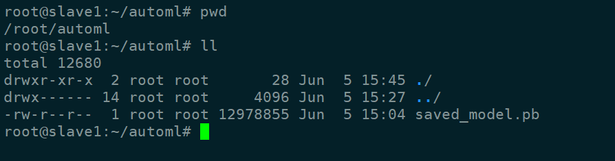
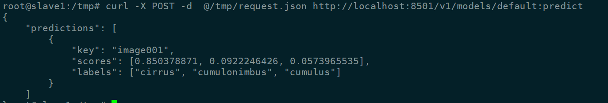

# Google-AutoML


# Edge端容器部署教程    
https://cloud.google.com/vision/automl/docs/containers-gcs-tutorial   


## 导出模型放置到 /root/automl




## 下载docker
```
export CPU_DOCKER_GCR_PATH=gcr.io/cloud-devrel-public-resources/gcloud-container-1.14.0:latest

sudo docker pull ${CPU_DOCKER_GCR_PATH}

```


##  运行docker容器
```
sudo docker run --rm --name ${CONTAINER_NAME} -p ${PORT}:8501 -v ${YOUR_MODEL_PATH}:/tmp/mounted_model/0001 -t ${CPU_DOCKER_GCR_PATH}

```


**实际命令**

```
docker run --rm --name cloudcloud  -p 8501:8501 -v /root/automl:/tmp/mounted_model/0001 -t ${CPU_DOCKER_GCR_PATH}

```

**正确启动后显示**

```
Running gRPC ModelServer at 0.0.0.0:8500 ...


Exporting HTTP/REST API at:localhost:8501 ...


8501就是restful的端口
```

##  验证模型

**发送请求**
```
curl -X POST -d  @/tmp/request.json http://localhost:8501/v1/models/default:predict
```


**收到回复消息**

```
{
    "predictions": [
        {
            "key": "image001",
            "scores": [0.850378871, 0.0922246426, 0.0573965535],
            "labels": ["cirrus", "cumulonimbus", "cumulus"]
        }
    ]

```





------------------

#  GPU


```
apt update &&  apt-get install build-essential -y
```
